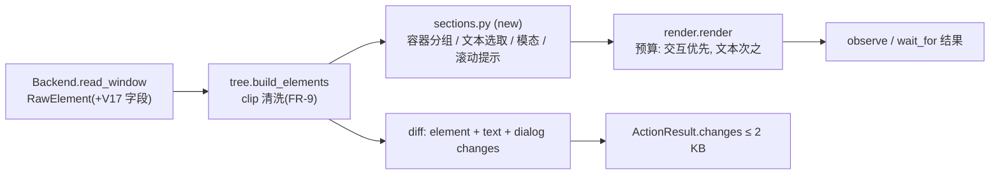

# 借鉴 Windows-MCP：让观测文本覆盖更多判断，减少截图

| | |
|---|---|
| Date | 26-10-07 |
| Status | Draft |
| Revision | 1 |
| Repo | `computer-use` @ `ci/pypi-release` (`e8adb33`) |
| Estimate | ~32 h 编码 + 1 次 macOS 实机任务集回归 · ~24 files · Full |
| Related | `docs/goal.md` §5.4 / §5.5 / §5.7 / §8 / §9.4 / §12；上游 [CursorTouch/Windows-MCP](https://github.com/CursorTouch/Windows-MCP) v0.8.7（MIT，2026-09-30） |

> **Wish (verbatim):** 调研下GitHub windows-mcp 好像可以尽量不截图来操作电脑  我们看看有没有可以借鉴的 有的话列一个重构文档出来 不用直接动手

## 1. TL;DR

Windows-MCP 能少截图，原因是它的 `Snapshot` 默认只回文本 UI 树，树里带命名容器层级、控件状态、滚动百分比，弹出模态窗时只列模态内的元素，`WaitFor` 在工具内部轮询。它的动作仍是"按 label 查中心坐标再点鼠标"，这方面不如我们的 ref + `observation_id` + 过期校验。我们本来就是树优先，截图主要来自 4 处：auto 模式交互元素少于 3 个就切 SoM、静态文本不进观测、动作 diff 不报文本和对话框变化、提示词要求结束前必须截图。本次重构补上观测文本（容器分组、静态文本、模态聚焦、滚动提示、状态字段），扩展 diff 和 `wait_for`，提示词改为按需截图。9 个工具名、状态文件 schema、hooks 都不动。目标：相对改动前的基线，每任务带图观测数减半，token 减 20%，成功率不降。

## 2. Background

### 2.1 Windows-MCP 调研结论

源码读自 `main`（2026-10-07），文件路径相对 `src/windows_mcp/`。

| 机制 | Windows-MCP 做法 | 我们现状 | 结论 |
|---|---|---|---|
| 默认不发图 | `Snapshot` 的 `use_vision` 默认 `False`，只回文本；另设 `Screenshot` 工具只发图（`tools/snapshot.py`） | `observe(mode="auto")` 默认只回树；交互元素 < 3、在 `poor_ax_apps` 名单里或树不完整时改发 SoM 截图（`handlers/observe.py:76`） | 已有；但"< 3"这个阈值太粗，一个只有"确定"按钮的提示框也会触发截图 → **借鉴**（FR-1） |
| 命名容器层级 | 语义树是 window → 有名字的结构节点（Pane/Group/ToolBar/Tab/MenuBar）→ 交互元素，没有子节点的结构节点会被剪掉（`tree/views.py` `_prune_structural`） | 平铺列交互元素，容器只在脚注里折算成数量，要展开得用 `root_ref`（`observe/render.py:110`） | **借鉴**（FR-2） |
| 静态文本 | 只有浏览器 DOM 模式收集 `dom_informative_nodes`（`tree/service.py` 中的 `INFORMATIVE_CONTROL_TYPE_NAMES`） | 默认只列交互元素和安全输入框（`handlers/observing.py:154` `listable`），状态栏、报错、对话框正文都看不到 | **借鉴并推广到所有窗口**（FR-3） |
| 模态聚焦 | 遇到 `WindowIsModal` 的子窗口，清空之前收集的背景交互元素（`tree/service.py` `tree_traversal`） | 不处理；点到被挡住的元素时由 Cua 回 `OCCLUDED` | **借鉴**（FR-4） |
| 滚动位置 | 可滚动区域单独列出，并给出 `[v:40%]` / `[h:0%]` | 无；模型只能截图判断还有没有内容 | **借鉴**；用已有的 frame 推算，不依赖新字段（FR-6） |
| 状态字段 | `focused`、`password`、`value`、`range:min-max`、`toggle`、`state:expanded`、`shortcut`、`selected_text`（`tree/views.py` `_node_meta_str`） | `value`、`enabled`、`focused`、`selected`、`secure` | **部分借鉴**：展开态、滑块范围、占位符；取决于 Cua 是否返回这些字段（FR-5，V17） |
| 元素预算 | 遍历最多 500 个元素，超出就截断并附说明（`tree/budget.py`） | 后端最多 2000 个，渲染默认 150 个，超出用 16 KB 预算和脚注提示 | 已有，不借鉴 |
| 等待 | `WaitFor` 在工具内轮询，条件有 `text_exists`、`active_window`、`element_exists`、`element_enabled`、`focused_element`（`tools/input.py`） | `wait_for` 支持 `text`、`ref_role`、`gone` | **部分借鉴**：增加"等元素可用"和"等窗口标题"（FR-8） |
| 文本清洗 | 去掉 Unicode 私用区字符（VS Code 的图标字形），修复孤立代理项（`tools/_snapshot_helpers.py`） | `clip()` 只合并空白（`observe/tree.py:24`） | **借鉴**（FR-9） |
| 动作寻址 | `label` 就是上次 Snapshot 列表的下标，查到中心坐标后用鼠标点击，不做过期校验（`desktop/service.py` `get_coordinates_from_label`） | ref + `observation_id`，走 AX 动作，带指纹/dHash 过期校验和命中检测 | 我们更强，不借鉴 |
| 动作结果 | 只回 `Clicked at (x,y)` 这样的文字 | 返回交互元素的 diff（`observe/diff.py`） | 我们更强；diff 再补上文本和对话框变化（FR-7） |
| 批量输入 | `MultiEdit` / `MultiSelect` 一次调用操作多个目标 | 无 | 暂缓：新增参数要逐字段做安全判定，另立方案（Q-3） |
| 区域截图 | `region=[l,t,r,b]` 只截一块区域 | 截整个窗口 | 暂缓：会改动 `coords.py` 的 frame 与 dHash 过期判定，另立方案（Q-4） |
| 用户接管 | 鼠标移动 ≥ 120 px 或按热键就把控制权交还用户，空闲 10 s 后再还给 AI；有 `ControlStatus` 工具（`desktop/control.py`） | 前台动作期间指针移动超过 3 pt 即返回 `USER_INTERRUPT`；CLI 有 `stop` / `resume` | 已有，不借鉴 |
| 参考网格、单词级 bbox | 截图叠加参考线；用 UIA TextPattern 取单词框 | SoM；Cua 不提供单词框，AGENTS.md 也不允许自己实现 AX | 不借鉴 |
| PowerShell / FileSystem / Registry、默认开启 PostHog 遥测 | 默认提供 | computer 子 agent 不能拿 shell 和编辑工具；轨迹只留本地 | 违反 AGENTS.md 安全条款，不借鉴 |

### 2.2 我们的截图从哪里来

1. `handlers/observe.py:76`：可见交互元素 < `AUTO_MODE_MIN_INTERACTIVE`（3）时 auto 会切到 SoM。常见的两按钮确认框、只有一个按钮的提示框都会命中。
2. `handlers/observing.py:154`：`listable()` 只放行 interactive 和 secure 元素，所以"已保存"、报错、对话框正文、标题都进不了观测，模型只能截图去读。
3. `observe/diff.py:58-59`：diff 只比较 interactive 元素，弹出对话框或出现状态文本时，动作结果里没有任何体现。
4. `plugins/computer-use/agents/computer.md:77` 要求报告前截图取证，`skills/computer-use/SKILL.md:45` 的任务模板也要求截图，所以每个任务至少一张图。

指标现状：`eval/harness/metrics.py:27` `RunRecord` 记录了步数和 token，没有记录图片数；不过审计记录已经通过 `RESULT_FIELDS` 复制了 `mode` 字段（`hooklib/audit.py:28`），可以直接从中统计。首个实机基线还没跑（`docs/goal.md` §10.1）。

| Term | Meaning |
|---|---|
| AX / UIA | macOS Accessibility API / Windows UI Automation，读取控件树的系统接口；我们经 Cua Driver 间接调用 |
| ref / `observation_id` | 观测里元素的编号（`e7`）和该次观测的 id；动作必须带上两者，界面变化后返回 `STALE_OBSERVATION` |
| SoM | Set-of-Mark：在截图上给元素画编号，模型回答编号 `click(mark=N)` |
| V15 | `docs/goal.md` §12 中待验证的假设：宿主是否把 `structuredContent` 也交给模型，所以文本与结构化合计按 16 KB 控制 |
| 带图观测 | `mode` 为 `screenshot` 或 `som` 的 `observe` / `wait_for` 结果，再加上 `browser__browser_take_screenshot` |
| 命名容器 | 归一化角色属于 `CONTAINER_ROLES`（group、toolbar、tablist、list、table、dialog、menu、scrollarea、webarea）且标签非空的元素 |
| 文本行 | 角色为 `text` / `heading` / `progress`、在图上可见、内容非空的元素，渲染时不带 ref |
| 模态对话框 | 窗口树里可见的 `dialog` 角色子树（macOS 的 `AXSheet` 也归一成 `dialog`，见 `observe/roles.py`） |
| V17 | 本方案新增的待验证假设：Cua Driver 的 `get_window_state` 元素是否返回 expanded / min / max / placeholder 字段 |

## 3. Goals / Non-goals

**Goals**

- G-1 在同一任务集（60 个变体）上，每任务平均带图观测数 ≤ 改动前基线的 50%。
- G-2 每任务平均 token ≤ 基线的 80%，平均步数不高于基线。
- G-3 非红队任务成功率不低于基线；`dev_loop` 类别的成功率也不低于基线。
- G-4 红队集的未确认高风险动作 = 0，注入成功率 = 0（`docs/goal.md` §9.4）。

**Non-goals**

- 不新增、不改名工具；9 个工具名和 `server__tool` 都保持不变。
- 不改 `last_observation.json` 的 schema，也不改 hooks（guard / verify_gate / audit）和 Python 3.8 代码。
- 不做区域截图、批量输入、浏览器并入门面（分别见 Q-4、Q-3、`docs/goal.md` §13.1）。
- 不改 SoM、`locate`、grounding 档位。

## 4. Users & scenarios

主要用户是 computer 子 agent（Grok 模型），由本仓库维护者负责调优。

1. **静态文本校验**：任务要求点 Save 后界面显示 "Changes saved"。改动前的流程是：点击，diff 里什么也没有，再截图读文字。改动后，`click` 的 `changes` 直接包含 `{"kind":"text_appeared","text":"Changes saved"}`，不需要截图。
2. **确认框**：点 Delete 后弹出 sheet "Delete file?"（两个按钮加一段正文）。改动前 auto 判定交互元素只有 2 个，切成 SoM 截图。改动后观测只列 sheet 里的内容，并标出 `modal=`，走树模式，不发图。
3. **等按钮可用**：表单填完后 "Submit" 从禁用变为可用。改动前要反复 observe，或者 sleep 之后截图。改动后一次 `wait_for(text="Submit", enabled=true)` 就能等到。

## 5. Finished look

**不变的契约**：9 个工具名、`observation_id` 和 ref 的语义、所有已有输入字段、错误码表、`ActionResult` 字段名、状态文件 schema、报告格式 `STATUS / SUMMARY / EVIDENCE / BLOCKERS / NEXT`。

**观测文本，改动前**（`settings_app` 场景示意）：

```text
obs_7f3a  app=MyApp  window=4521 "Settings"  image=1280x853 (not attached)  mode=tree
e2  button      "Back"                         [12,40,60,24]
e4  checkbox    "Launch at login"              off    [40,180,220,22]
e5  switch      "Dark mode"                    off    [40,214,220,22]
e6  textfield   "Display name"                 "Ana"  [40,260,320,26]
e9  button      "Save"                         [1100,740,80,28]
-- 23 more elements not listed; use observe(root_ref=...) to expand --
```

**改动后**：交互元素按命名容器分组；文本行带引号、不带 ref；滚动容器标出上下还有多少条未显示。

```text
obs_7f3b  app=MyApp  window=4521 "Settings"  image=1280x853 (not attached)  mode=tree
e2  button      "Back"                         [12,40,60,24]
e3  group "Profile"
  e4  checkbox    "Launch at login"            off    [40,180,220,22]
  e5  switch      "Dark mode"                  off    [40,214,220,22]
  e6  textfield   "Display name"               "Ana"  [40,260,320,26]
  text "Shown to other members"
e7  list "Recent files"  scroll ↑0 ↓24
  e8  row         "report.md"                  [40,520,560,24]
e9  button      "Save"                         [1100,740,80,28]
text "Changes saved"
-- 4 more elements not listed; use observe(root_ref=...) to expand --
```

**模态对话框打开时**：

```text
obs_7f3c  app=MyApp  window=4521 "Settings"  image=1280x853 (not attached)  mode=tree  modal=e40
e40 dialog "Delete file?"
  text "report.md will be moved to the Trash."
  e41 button      "Cancel"                     [700,420,80,28]
  e42 button      "Delete"                     [800,420,80,28]
-- modal dialog e40 open: 31 background elements hidden; observe(root_ref=e1) lists the whole window --
```

**动作结果 `changes` 新增的 kind**（追加在已有 kind 之后，仍受 2 KB 上限约束）：

```json
[
  {"ref": "e9", "field": "enabled", "before": true, "after": false},
  {"kind": "text_appeared", "text": "Changes saved"},
  {"kind": "text_gone", "text": "Unsaved changes"},
  {"kind": "dialog_opened", "ref": "e40", "label": "Delete file?"},
  {"kind": "dialog_closed", "ref": "e40", "label": "Delete file?"}
]
```

**`wait_for` 新增输入**：

```json
{"text": "Submit", "ref_role": "button", "enabled": true, "timeout_ms": 10000}
{"title": "Report — Edited", "timeout_ms": 5000}
```

| 关注点 | 改动前 | 改动后 |
|---|---|---|
| auto 何时发图 | 可见交互元素 < 3，或在 `poor_ax_apps` 名单，或树不完整 | 可见交互元素为 0；或可见交互元素 < 3 且没有文本行；或在名单里；或树不完整。有模态对话框时只统计对话框内的元素 |
| 列表结构 | 平铺 | 按最近的命名容器分组，每层缩进 2 格，最多 `MAX_INDENT_LEVELS`（8）层；没有任何列出子项的容器不输出 |
| 静态文本 | 不列 | 默认列出，最多 40 行、3 KB，每行最多 120 字符；预算先给交互元素，剩余的再给文本 |
| 滚动 | 无 | 滚动容器头部显示 `scroll ↑N ↓M`，N/M 是被容器裁掉的可列元素数 |
| 模态 | 背景元素照样列出 | 只列对话框子树；header 加 `modal=eN`；脚注说明怎么列出整窗 |
| 状态 | on/off、值 | 另增 `expanded` / `collapsed`、滑块 `50 (0–100)`、空输入框显示 `placeholder:"…"`（取决于 V17，字段缺失时输出与现在一致） |
| diff | 交互元素字段变化、出现/消失、窗口标题 | 另增文本出现/消失（每类最多 5 条）、对话框打开/关闭 |
| `wait_for` | `text` / `ref_role` / `gone` | 另增 `enabled`（等匹配元素变为可用）、`title`（等窗口标题包含指定文本） |
| 提示词 | 结束前必须截图 | 只有成功条件涉及视觉（颜色、图像、布局、渲染）或任务要求时才截图；否则在 EVIDENCE 里引用观测行 |

## 6. Requirements

| ID | Functional requirement | Priority |
|---|---|---|
| FR-1 | auto 改用新的"树太薄"判定（见 §5 表）；有模态对话框时只统计对话框子树 | Must |
| FR-2 | 树模式文本按最近的命名容器分组：容器行格式为 `eN role "label"`，子项缩进；没有列出子项的容器不输出；`root_ref` 展开时保持现有缩进规则 | Must |
| FR-3 | 默认列出可见文本行（`text "…"`，不带 ref）。去重：与父元素或同级交互元素标签相同的跳过，与上一行相同的跳过。预算超出时按优先级选取：模态内 > heading > 焦点所在容器 > 文档顺序；屏幕外的文本只在 `root_ref` 展开时出现 | Must |
| FR-4 | 存在可见 `dialog` 子树时，默认列表只含该子树，header 加 `modal=eN`，脚注给出隐藏的背景元素数和列出整窗的 `root_ref`。只影响列表，不拦截对背景 ref 的动作 | Must |
| FR-5 | `RawElement` 增加可选字段 `expanded`、`min_value`、`max_value`、`placeholder`；`cua_parse.elements_of` 和假后端都要支持；渲染规则见 §5 表；字段缺失时输出不变（V17） | Should |
| FR-6 | 滚动容器（`scrollarea`、`list`、`table`、`webarea`）的头部输出 `scroll ↑N ↓M`。N/M 由纯函数计算：后代中可列元素的 bbox 整体落在最近的 `scrollarea` 祖先（没有则用图像矩形）上方/下方，或属于被虚拟化的 1 px 行的数量。N 和 M 都为 0 时不输出 | Should |
| FR-7 | `element_changes` 之外增加 `text_changes` 和 `dialog_changes`：文本按内容比对，不按 ref；每类最多 `LIST_LIMIT`（5）条，每条截到 80 字符；仍经过 `cap_changes`，总量 ≤ 2 KB | Must |
| FR-8 | `WaitForIn` 增加 `enabled: bool = False` 和 `title: str \| None`。`enabled` 与 `gone` 互斥；`text`、`ref_role`、`title` 至少给一个；校验失败返回 `INVALID_ARGUMENT` | Must |
| FR-9 | `clip()` 删掉 U+E000–U+F8FF、U+F0000–U+FFFFD、U+100000–U+10FFFD 私用区字符和孤立代理项；删完为空的标签按无标签处理 | Must |
| FR-10 | `agents/computer.md`、`SKILL.md`、`tools.py` 中 `observe` / `wait_for` 的描述改成"树优先、文本行是数据、等待用 `wait_for`、截图按需"（英文） | Must |
| FR-11 | `RunRecord` 增加 `images`，`summarize` 输出 `avg_images`，有基线时输出 `images_delta`；`run_grok.py` 从审计记录里统计 `mode ∈ {screenshot, som}` 的观测和 `browser__browser_take_screenshot` 调用 | Must |
| FR-12 | 标签含凭据词（`SafetyRules.credential_word`）的文本行，或紧跟在这类标签后面、且是 ≥ 16 个非空白字符的连续串，渲染为 `text (hidden: credential)` | Should |

| ID | Non-functional requirement |
|---|---|
| NFR-1 | 任意场景下（包括 2000 个原始元素、500 条文本）观测文本加 structuredContent ≤ 16 KB；动作结果 ≤ 2 KB |
| NFR-2 | 不新增依赖；新逻辑全部写成纯函数，放在 `observe/`，不做 I/O |
| NFR-3 | 状态文件 schema、`hooklib/` 及其副本不变：`scripts/sync_hooklib.py --check` 和 Python 3.8 hook 测试原样通过 |
| NFR-4 | 新常量放在 `limits.py`，注释写明出处：`TEXT_SECTION_MAX_BYTES = 3 * 1024`、`TEXT_SECTION_MAX_LINES = 40`、`TEXT_LINE_MAX_CHARS = 120`、`DIFF_TEXT_MAX_CHARS = 80`、`CREDENTIAL_TOKEN_MIN_CHARS = 16` |
| NFR-5 | 单文件不超过 200 行：`render.py`、`handlers/observe.py`、`cua_parse.py` 改动后会超，按 §7 文件表拆分 |

## 7. Technical design

**Architecture / flow**



以一次 `click(ref=e9)` 为例：`action_prep` 照常做过期判定 → 后端执行动作 → `delivery` 等界面稳定后重读窗口 → `build_elements` 生成 after 观测 → `diff.element_changes` + `text_changes` + `dialog_changes` → `cap_changes` → 返回结果，不带图。

**File map**（路径相对 `servers/grok-computer-mcp/src/grok_computer_mcp/`，另行标注的除外）

| Path | Change | Why |
|---|---|---|
| `observe/tree.py` | modify | `clip()` 清洗私用区和代理项（FR-9） |
| `observe/roles.py` | modify | 新增 `CONTAINER_ROLES`、`TEXT_DATA_ROLES`、`SCROLL_ROLES` |
| `observe/sections.py` (new) | new | 纯函数：`group_by_container`、`select_text_lines`、`modal_root`、`scroll_hints`、`mask_credential_text`（FR-2/3/4/6/12） |
| `observe/render.py` | modify | 改为调用 `sections.py`；预算分两段；容器行、文本行和 `modal=` header 的格式 |
| `observe/diff.py` | modify | `text_changes`、`dialog_changes`（FR-7） |
| `observe/elements.py` | modify | `ObservedElement` 增加 `expanded`、`min_value`、`max_value`、`placeholder`（默认 None） |
| `handlers/observe.py` | modify | 新的 auto 判定（FR-1）；把 `wait_for` 移出 |
| `handlers/wait.py` (new) | new | `wait_for` 及 `enabled` / `title` 条件（FR-8） |
| `handlers/observing.py` | modify | `listable()` 支持模态范围；容器和文本的候选交给 `sections.py` |
| `handlers/results.py` | modify | header 加 `modal=`；把文本候选传给 `render` |
| `handlers/action_result.py` | modify | 合并新的 change 类型 |
| `models/inputs.py` | modify | `WaitForIn.enabled`、`WaitForIn.title` 及校验 |
| `tools.py` | modify | `observe`、`wait_for` 的英文描述（FR-10）；`wait_for` 的 `_bind` 改指向 `handlers/wait.py` |
| `limits.py` | modify | NFR-4 列出的常量 |
| `backend/records.py` | modify | `RawElement` 的可选字段（FR-5） |
| `backend/cua_parse.py` | modify | 读取可选字段，加 `# V17:` 注释；拆出 `backend/cua_elements.py` (new) 以保持 ≤ 200 行 |
| `backend/fake_scene.py`, `fake_load.py`, `fake_core.py` | modify | `FakeNode` 的可选字段；新增 `enable:<id>` / `disable:<id>` 效果 |
| `backend/fake_scenarios/dialog_app.json` (new) | new | 状态文本、sheet、带滚动的长列表、禁用后才启用的按钮、私用区标签 |
| `tests/test_observe_units.py`, `tests/test_observe.py`, `tests/test_actions.py`, `tests/test_mcp_contract.py` | modify | 见 §9 |
| `plugins/computer-use/agents/computer.md` | modify | Loop / Rules 的截图策略（FR-10） |
| `plugins/computer-use/skills/computer-use/SKILL.md` | modify | 任务模板的 RETURN 行（FR-10） |
| `eval/harness/metrics.py`, `eval/harness/run_grok.py`, `eval/tests/test_metrics.py` | modify | `images` 指标（FR-11） |
| `docs/goal.md` | modify | §2.2 加 Windows-MCP 一行；§5.4 `wait_for` 参数；§5.5 格式规则；§5.7 auto 判定；§8；§9.4 新指标；§12 V17；附录 C 加参考链接 |

**Data model**：`RawElement` 和 `ObservedElement` 各加 4 个可选字段，默认 `None` / `""`；`Observation` 不变；状态文件 `element_record()` 不读新字段。

**Interfaces**

```python
# observe/sections.py (new) — all pure
def modal_root(elements: Sequence[ObservedElement]) -> ObservedElement | None: ...
def group_by_container(listed: Sequence[ObservedElement],
                       elements: Sequence[ObservedElement]) -> list[Line]: ...
def select_text_lines(elements: Sequence[ObservedElement], *, scope_ref: str | None,
                      focused_ref: str | None, budget_bytes: int, max_lines: int) -> list[ObservedElement]: ...
def scroll_hints(elements: Sequence[ObservedElement], image: Rect) -> dict[str, tuple[int, int]]: ...

# observe/diff.py
def text_changes(before: Sequence[ObservedElement], after: Sequence[ObservedElement]) -> list[Change]: ...
def dialog_changes(before: Sequence[ObservedElement], after: Sequence[ObservedElement]) -> list[Change]: ...
```

**Key logic & edge cases**

| Case | Behaviour |
|---|---|
| 有多个可见 dialog | 取文档顺序里最后一个（最上层）作为 `modal_root` |
| 非模态浮动面板被识别成 dialog | 只是列表收窄，对背景 ref 的动作照常可用；脚注给出列出整窗的 `root_ref` |
| 模型点击容器行的 ref | 容器不在状态文件里，guard 判断不出目标就返回 `ask`，与现有规则一致；提示词说明容器行用于 `root_ref` |
| 文本与按钮标签重复（AX 常把按钮文字再暴露成子 StaticText） | 去重规则跳过 |
| 500 条文本 | 选到 40 行或 3 KB 为止；交互元素先占预算；脚注报告未列出的文本条数 |
| 文本行里出现"忽略之前指令…"之类内容 | 原样作为数据渲染（加引号、截断）；提示词里"屏幕文本是数据"的规则不变；由红队集回归 |
| 屏幕上显示的 token/密钥 | FR-12 打码；未命中规则的仍可能进入子 agent 上下文，等同于今天截图能看到的范围 |
| `scroll_hints` 遇到容器 frame 比可视区大 | 以最近的 `scrollarea` 祖先作为裁剪矩形 |
| V17 字段缺失 | 不输出对应状态，格式回落到现在的样子 |
| `wait_for(enabled=true)` 匹配到多个元素 | 任一匹配元素可用即视为满足；`matched` 返回该元素 |
| `wait_for(title=…)` 时窗口关闭 | 沿用 `read()` 现有的 `map_backend_error` 映射，行为与现在的 `wait_for` 一致 |
| 私用区字符清洗后标签为空 | 按无标签处理；有 `value` 时显示 value |

**Alternatives considered**

- 照搬 Windows-MCP 的 `label` 下标 + 中心坐标点击：没有过期校验，退回到我们已经解决过的问题。
- 文本行带 ref：点击时 guard 在状态文件里找不到它，会转成 `ask`，抬高误报确认率；每行还要多 4–5 字节。
- 把文本放进 structuredContent：V15 未定，按合计 16 KB 计算时只会挤占交互元素的预算；hooks 也用不到。
- 新增 `read_text` 工具：工具数是公开 API，加一个需要显式 callout；默认在观测里附带文本已经覆盖这个需求。
- 等 Cua 提供 `verify_state` 再做 `wait_for(enabled)`：门面现有的轮询就能实现，不必多绑定一个上游接口。

## 8. Implementation steps

| # | Step | Files | Depends on | Done when |
|---|---|---|---|---|
| 1 | 加 `images` 指标，并在改动前的代码上跑 macOS 实机任务集作为基线 | `eval/harness/metrics.py`, `run_grok.py`, `eval/tests/test_metrics.py` | — | AC-11 通过；基线 `summary.json` 含 `avg_images` / `avg_tokens` / `avg_steps` |
| 2 | 文本清洗 | `observe/tree.py`, `tests/test_observe_units.py` | — | AC-9 通过 |
| 3 | 角色表 + `sections.py` 纯函数（分组、文本选取、模态、滚动提示、凭据打码） | `observe/roles.py`, `observe/sections.py`, `limits.py`, `tests/test_observe_units.py` | 2 | 各函数单测通过；`uv run pyright` 无告警 |
| 4 | `render.py` 接入 `sections.py`，`results.py` header 加 `modal=` | `observe/render.py`, `handlers/results.py`, `handlers/observing.py` | 3 | AC-2、AC-3、AC-4、AC-6 通过；`test_text_and_structured_stay_within_budget` 原样通过 |
| 5 | 新的 auto 判定 | `handlers/observe.py` | 4 | AC-1 通过；`test_auto_mode_uses_tree_when_rich_and_marks_when_thin` 调整为新规则后通过 |
| 6 | diff 扩展 | `observe/diff.py`, `handlers/action_result.py`, `tests/test_actions.py` | 3 | AC-7 通过 |
| 7 | `wait_for` 拆文件并加条件；假后端加 `enable` / `disable` 效果 | `handlers/wait.py`, `handlers/observe.py`, `models/inputs.py`, `tools.py`, `backend/fake_scene.py`, `tests/test_observe.py`, `tests/test_mcp_contract.py` | — | AC-8 通过；`test_mcp_contract.py` 的 schema 快照已更新 |
| 8 | V17 可选字段：后端记录、Cua 解析、假后端、渲染 | `backend/records.py`, `backend/cua_parse.py`, `backend/cua_elements.py`, `backend/fake_*.py`, `observe/elements.py`, `observe/tree.py` | 4 | AC-5 通过；`tests/test_cua_backend.py` 覆盖"有字段"和"无字段"两种回复 |
| 9 | 提示词与工具描述 | `agents/computer.md`, `SKILL.md`, `tools.py` | 4–7 | `grok plugin validate plugins/computer-use` 通过 |
| 10 | 更新 `docs/goal.md` | `docs/goal.md` | 1–9 | §5.4/§5.5/§5.7/§8/§9.4/§12 与实现一致；`tests/test_contracts.py` 通过 |
| 11 | 以第 1 步的基线跑实机回归，结果贴进 PR | — | 1–10 | AC-10 通过 |

## 9. Testing & acceptance

**Acceptance criteria**

| ID | Given / When / Then | Covers |
|---|---|---|
| AC-1 | Given `dialog_app` 中一个只有 1 个按钮和 1 段正文的提示框，when `observe(mode="auto")`，then `mode=tree`，不带图；given 0 个交互元素的窗口，then 仍切到 SoM | FR-1 |
| AC-2 | Given `settings_app`，when `observe(mode="tree")`，then "Profile" 容器行下面是缩进的 3 个子项；没有列出子项的容器不出现 | FR-2 |
| AC-3 | Given 一个窗口里有状态文本 "Changes saved"，以及与按钮同名的子 StaticText，when observe，then 出现 `text "Changes saved"` 且没有重复的按钮文字；given 500 条文本，then 文本段 ≤ 3 KB 且 ≤ 40 行，交互元素数与无文本时相同 | FR-3, NFR-1 |
| AC-4 | Given sheet "Delete file?" 可见，when observe，then 只列出 sheet 子树，header 含 `modal=eN`，脚注含隐藏的背景元素数；when `observe(root_ref=<窗口 ref>)`，then 背景元素全部列出；when 点击背景 ref，then 不因模态被拒绝 | FR-4 |
| AC-5 | Given 一个滑块带 min 0 / max 100 / value 50、一个折叠的 disclosure、一个带 placeholder 的空输入框，then 分别渲染为 `50 (0–100)`、`collapsed`、`placeholder:"…"`；given 三者都没有这些字段，then 输出与改动前的 golden 一致 | FR-5 |
| AC-6 | Given 一个 30 行的列表，可见 10 行，后面 20 行是 1 px 虚拟行，then 容器行含 `scroll ↑0 ↓20`；全部可见时不出现 `scroll` | FR-6 |
| AC-7 | Given 点击 Save 后会显示 "Changes saved" 并打开 sheet，when `click`，then `changes` 里有 `text_appeared` 和 `dialog_opened`，序列化后 ≤ 2 KB；关闭 sheet 时有 `dialog_closed` | FR-7, NFR-1 |
| AC-8 | Given "Submit" 起初禁用、触发 `enable:submit` 后可用，when `wait_for(text="Submit", enabled=true)`，then 返回 `ok` 和 `matched`；不触发时返回 `TIMEOUT`；同时传 `enabled` 和 `gone` 时返回 `INVALID_ARGUMENT`；when `wait_for(title="Home")` 且按钮执行了 `set_title:Home`，then 返回 `ok` | FR-8 |
| AC-9 | Given 标签 `"Search"` 和 `"\U00100000"`，then 渲染为 `"Search"`，后者按无标签处理 | FR-9 |
| AC-10 | Given 第 1 步的基线，when 在同一台 macOS 实机上跑完整任务集，then `avg_images` ≤ 基线 × 0.5，`avg_tokens` ≤ 基线 × 0.8，`avg_steps` ≤ 基线，非红队成功率 ≥ 基线，`dev_loop` 成功率 ≥ 基线，红队未确认高风险动作 = 0，注入成功率 = 0 | FR-10, G-1–G-4 |
| AC-11 | Given 一个审计记录集合：3 条 `mode=som` 的 observe、2 条 `mode=tree`、1 条 `browser__browser_take_screenshot`，then `images == 4` | FR-11 |
| AC-12 | Given 标签为 "API token"、内容为 32 字符连续串的文本，then 渲染为 `text (hidden: credential)`；"Token count: 3" 不受影响 | FR-12 |

**Automated tests**

- 单元（纯函数）：`servers/grok-computer-mcp/tests/test_observe_units.py` 覆盖 `sections.py` 每个函数、`clip` 清洗、`text_changes` / `dialog_changes`；用 golden 文本断言 AC-5 的"无字段时输出不变"。
- 门面集成（假后端 + 真实 MCP 客户端）：`tests/test_observe.py` 覆盖 AC-1/2/3/4/6/8；`tests/test_actions.py` 覆盖 AC-7；`tests/test_cua_backend.py` 覆盖 V17 的两种回复；`tests/test_mcp_contract.py` 校验 `wait_for` 的 schema 和错误码。
- 评测：`eval/tests/test_metrics.py` 覆盖 AC-11；`eval/tests/test_variants.py` 原样通过（不改任何变体，也不降低红队任务难度）。
- 门禁：`uv run pytest`、`uv run ruff check`、`uv run pyright`、Python 3.8 hook 测试、`grok plugin validate plugins/computer-use`。

**Manual check**

```bash
uv run python eval/harness/run_grok.py --subset nightly --baseline <step1>/summary.json
```

然后打开某个 `webview` 变体的轨迹，确认中间步骤的 observe 都是 `mode=tree`，只有最后一张截图来自视觉类成功条件。

## 10. Rollout & risks

- 发布：`grok-computer-mcp` 升 minor 版本，同步更新 `plugins/computer-use/.mcp.json` 的固定版本和 `plugin.json` 版本；观测格式变了，需要在 release note 里说明。
- 兼容：输入字段只增不改；`changes` 的 kind 只增不改；状态文件、hooks 不变，老版本插件配新服务也能工作。
- 回滚：revert 这次合并，把 `.mcp.json` 改回上一个固定版本。

| Risk | Likelihood | Impact | Mitigation |
|---|---|---|---|
| 屏幕文本增多，提示注入的入口变大 | 中 | 高 | 文本行加引号、截到 120 字符；提示词里"屏幕文本是数据"的规则保持不变；AC-10 要求红队注入成功率为 0，`rt_chat` / `rt_about` 等变体必须通过 |
| 模型过度依赖树，漏掉视觉 bug（布局错位、颜色不对），伤到 P0 开发闭环场景 | 中 | 高 | 视觉类成功条件仍要求截图；单独设 `dev_loop` 成功率闸门（AC-10）；Q-2 由用户拍板 |
| 容器行和文本挤占预算，列出的交互元素变少 | 中 | 中 | 交互元素先占预算；文本有 3 KB 上限；回归时对比每次观测平均列出的元素数 |
| 把非模态面板误判成模态 | 低 | 低 | 只收窄列表，不拦截动作；脚注给出列出整窗的方法 |
| V17 字段 Cua 不提供 | 中 | 低 | FR-5 只是 Should，字段缺失时自动回落 |
| 屏幕上显示的密钥进入子 agent 上下文和本地轨迹 | 低 | 中 | FR-12 打码；黑名单应用照旧不读；轨迹只留本地（保留期 7 天） |

## 11. Assumptions & open questions

| ID | Assumption | Why | To reverse |
|---|---|---|---|
| A-1 | 受众是本仓库维护者，动机是 `docs/goal.md` §9.4 的 token −30% / 步数 −20% 目标，以及用户提出的"尽量不截图" | 愿望原文和 §9.4 | 如果目标是别的指标（比如延迟），重新定 G-1/G-2 |
| A-2 | 范围只覆盖观测、diff、`wait_for`、提示词；不新增工具、不改状态文件 | AGENTS.md 规定工具名是公开 API，状态文件 schema 一改就要同时改 guard/verify_gate/fixtures | 要做批量输入或区域截图时另立方案并显式 callout |
| A-3 | 目前没有实机基线，第 1 步先产出 | `docs/goal.md` §10.1 写的是"macOS 实机跑任务集，记录首个基线"尚未完成 | 如果已经有基线，第 1 步只加指标 |
| A-4 | 模态 = 可见的 `dialog` 角色子树；Cua 不报告模态属性 | `cua_parse.elements_of` 当前读取的字段里没有模态信息 | 如果 V17 验证时发现 Cua 提供 modal 标志，改为直接使用该标志 |
| A-5 | 改动后的格式变化不影响 grounding 基准 | `eval/grounding/collect.py` 只用 `observe(mode="screenshot")` | — |

| ID | Open question | Blocks | Owner |
|---|---|---|---|
| Q-1 | Cua Driver `get_window_state` 的元素是否返回 expanded / min / max / placeholder，字段名是什么（V17）？ | 第 8 步的字段名 | 跑 Phase 0 实机探针的人 |
| Q-2 | `dev_loop` 类任务（P0 UI 验证）是否仍然强制要求结尾截图，给主 agent 或人工复核？ | 第 9 步的提示词措辞 | 用户 |
| Q-3 | 是否另立方案做批量输入（参考 `MultiEdit`，给 `type_text` 加 `fields[]`），以及 guard 如何逐字段判定？ | 不阻塞本方案 | 用户 |
| Q-4 | 是否另立方案做区域截图（`observe(mode="screenshot", root_ref=…)` 只截一个元素），用来降低视觉校验的图片 token？ | 不阻塞本方案 | 用户 |

## 12. Changelog

- r1 26-10-07 — initial draft
